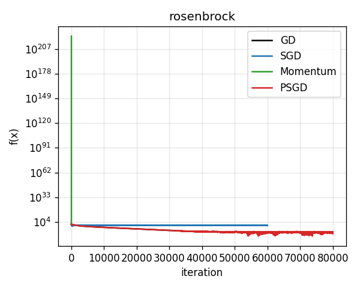
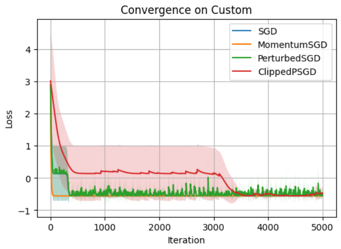
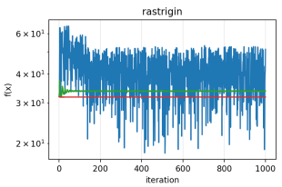

# Convergence Analysis of Perturbed Stochastic Gradient Descent in Non-Convex Landscapes

A comprehensive implementation and analysis of Enhanced Perturbed Stochastic Gradient Descent (PSGD) for escaping saddle points in non-convex optimization landscapes.

## Overview

This project implements and analyzes an **Enhanced Perturbed Stochastic Gradient Descent (PSGD)** algorithm for escaping saddle points in non-convex optimization. The algorithm combines EMA gradient smoothing, random perturbations, early exit strategies, and gradient clipping for robust convergence on multimodal landscapes.

## Theoretical Guarantees

Under standard smoothness assumptions, our Enhanced PSGD algorithm achieves:

- **Convergence Rate**: Õ(ℓΔ/ε² + σ²Δ/ε⁴) iterations to find an ε-second-order stationary point
- **Success Probability**: ≥ 1-δ with high probability bounds
- **Dimension Dependence**: Polylogarithmic in problem dimension d

Where ℓ is the smoothness parameter, Δ is the initial function gap, σ² is the variance bound, and ε is the target accuracy.

## Installation

### Prerequisites

- Python 3.8+
- NumPy
- Matplotlib
- Pathlib (standard library)

### Setup

1. Clone the repository:

```bash
git clone https://github.com/yourusername/nonconvex-sgd-analysis.git
cd nonconvex-sgd-analysis
```

2. Install dependencies:

```bash
pip install -r requirements.txt
```

Or manually:

```bash
pip install numpy matplotlib
```

3. (Optional) Create a virtual environment:

```bash
python -m venv venv
source venv/bin/activate  # On Windows: venv\Scripts\activate
pip install numpy matplotlib
```

## Usage

### Quick Start

Run the main experimental comparison:

```bash
cd src
python experiments.py
```

This will:

- Generate variance estimates for all benchmark functions
- Run comparative experiments (GD, SGD, SGD+Momentum, PSGD)
- Create convergence plots saved as `convergence_curves.png`

### Individual Components

#### 1. Variance Estimation

```bash
cd src
python variance.py
```

Computes mini-batch variance estimates for each benchmark function.

#### 2. Custom Experiments

```python
from functions import rastrigin, grad_rastrigin
from optimizers import perturbed_sgd
import numpy as np

# Define problem
f = rastrigin
grad_f = grad_rastrigin
x0 = np.array([-4.0, 4.0])

# Create stochastic gradient oracle
def stochastic_grad(x):
    noise = np.random.normal(scale=0.1, size=x.shape)
    return grad_f(x) + noise

# Run PSGD
x_opt, path = perturbed_sgd(
    stochastic_grad, f, x0,
    ell=1000,  # smoothness parameter
    rho=10000, # Hessian-Lipschitz parameter
    eps=1e-3,  # target accuracy
    sigma=0.1, # noise level
    max_iters=50000
)
```

## Benchmark Functions

### 1. Rastrigin Function

```python
f(x,y) = 10d + Σ(xi² - 10cos(2πxi))
```

- **Properties**: Highly multimodal, many local minima
- **Global minimum**: (0,0) with f\* = 0
- **Challenges**: Dense landscape of local optima

### 2. Rosenbrock Function

```python
f(x,y) = (1-x)² + 100(y-x²)²
```

- **Properties**: "Banana-shaped" valley, ill-conditioned
- **Global minimum**: (1,1) with f\* = 0
- **Challenges**: Narrow curved valley, slow convergence

### 3. Custom Multimodal Function

```python
f(x,y) = x² + y² + sin(3x)sin(3y)
```

- **Properties**: Quadratic bowl with sinusoidal perturbations
- **Global minimum**: Near (0,0) with f\* ≈ -1
- **Challenges**: Multiple local minima from trigonometric terms

## Results

### Convergence Plots



_Rosenbrock function convergence comparison_



_Custom multimodal function convergence comparison_



_Rastrigin function convergence comparison_

## Algorithm Details

### Enhanced PSGD Algorithm

The core algorithm implements the following steps:

1. **Gradient Smoothing**: Maintain EMA of stochastic gradients

   ```python
   g_ema = β * g_ema + (1-β) * g_batch
   ```

2. **Saddle Detection**: Check if smoothed gradient norm is small

   ```python
   if ||g_ema|| ≤ g_threshold and (t - t_noise) > t_threshold:
       # Inject perturbation
   ```

3. **Perturbation**: Add random noise from uniform ball

   ```python
   x ← x + ξ, where ξ ~ Uniform(B(0,r))
   ```

4. **Clipping**: Ensure numerical stability
   ```python
   g ← clip(g, g_max)
   x ← clip(x, x_max)
   ```

### Hyperparameter Selection

Key parameters are derived from theoretical analysis:

- **Perturbation radius**: r = √(c/χ²) · ε/ℓ
- **Gradient threshold**: g_thresh = √(c/χ²) · ε + σ/√B
- **Waiting period**: t_thresh = χ/c² · ℓ/√(ρε)
- **Step size**: η = c/ℓ where c ≤ c_max

### Key Observations

The convergence plots demonstrate that:

- **PSGD** shows the most robust convergence, reliably escaping saddle points
- **SGD + Momentum** achieves faster initial progress but can stagnate
- **Plain SGD** provides baseline performance but is prone to getting stuck
- **Full GD** is deterministic but limited by local landscape geometry

Key findings include EMA effectiveness in preventing false triggers, clipping benefits for numerical stability, and the importance of function-specific hyperparameter tuning.

## References

1. Jin, C., Ge, R., Netrapalli, P., Kakade, S. M., & Jordan, M. I. (2017). How to escape saddle points efficiently. _ICML 2017_.
2. Chen, Z., Zhou, D., & Gu, Q. (2022). Faster perturbed stochastic gradient methods for finding local minima. _PMLR_.
3. Ge, R., Huang, F., Jin, C., & Yuan, Y. (2015). Escaping from saddle points—online stochastic gradient for tensor decomposition. _COLT 2015_.
